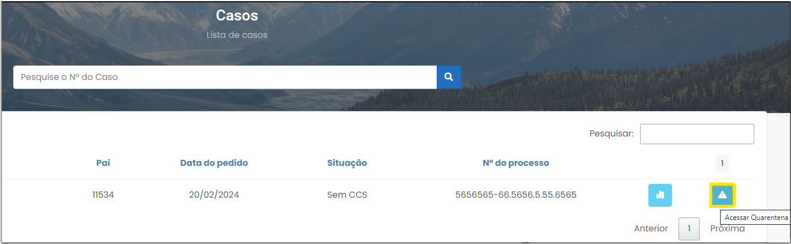

# Iniciando o processo de quarentena 

1 Para pesquisar um caso desejado, digite o N° do Caso no campo localizado no centro da página (Figura 5). 

 
*Figura 5 - Procurar casos.*   

2 Em seguida, clique em "Acessar Quarentena", no pedido desejado (Figura 6). 

 
*Figura 6 - Acessar Quarentena.*  

## Cabeçalho 

 
*Figura 7 - Cabeçalho.*   

Itens do cabeçalho 
<ul style="text-align: justify;" >
    <li><strong>Título:</strong> nome ilustrativo da investigação que facilita a identificação do seu objeto.</li>
    <li><strong>Status: </strong> andamento do caso dentro da linha de produção do relatório de análise. O status pode assumir os seguintes tipos: "Análise", "Pendente", "Concluído", "Encerrado", "Quarentena" ou "Novo". 
    <li><strong>Período:</strong> intervalo definido no cadastro do pedido que limita os termos iniciais e finais da investigação. </li>
    <li><strong>Data do pedido:</strong> momento em que o pedido foi elaborado pelo demandante. </li>
    <li><strong>Lotação:</strong> procuradoria ou auditoria de origem do procedimento investigatório. </li>
    <li><strong>Solicitante:</strong> demandante que cadastrou o PAI. </li>
</ul>

Botões 
<ul style="text-align: justify;" >
    <li><strong>Botão "CCS":</strong> É possível baixar os arquivos transmitidos pelo Banco Central que servirão de base para a demanda das contas a serem enviadas. Além disso, é possível baixar o PQS (pedido de quebra de sigilo) ou a decisão judicial que deferiu a quebra ou o ofício judicial. Esses documentos servirão como base jurídica para validação dos dados transmitidos e para a cobrança das instituições financeiras. </li>
    <li><strong>Botão "Quebras": </strong> É possível baixar os  arquivos transmitidos pelos bancos e também se obter alguns documentos encaminhados (ex. fatura de cartão, ficha de abertura de conta, extratos de investimento), que estão fora do padrão da Carta-Circular nº 3454/2010.  <svg height="35px" width="25px" style="vertical-align: middle" version="1.1" id="Layer_1" xmlns="http://www.w3.org/2000/svg" xmlns:xlink="http://www.w3.org/1999/xlink" viewBox="0 0 511.999 511.999" xml:space="preserve" fill="#000000" stroke="#000000"><g id="SVGRepo_bgCarrier" stroke-width="0"></g><g id="SVGRepo_tracerCarrier" stroke-linecap="round" stroke-linejoin="round"></g><g id="SVGRepo_iconCarrier"> <path style="fill:#F5C525;" d="M16.242,429.476L232.332,55.195c10.518-18.219,36.814-18.219,47.333,0l216.091,374.281 c10.518,18.219-2.63,40.991-23.666,40.991H39.908C18.872,470.467,5.723,447.695,16.242,429.476z"></path> <g> <path style="fill:#EFEFEF;" d="M255.999,322.45L255.999,322.45c-14.172,0-25.66-11.488-25.66-25.66V172.87 c0-14.172,11.488-25.66,25.66-25.66l0,0c14.172,0,25.66,11.488,25.66,25.66v123.92C281.659,310.962,270.171,322.45,255.999,322.45z "></path> <circle style="fill:#EFEFEF;" cx="256.001" cy="397.558" r="25.034"></circle> </g> <g> <path style="fill:#231F20;" d="M506.597,423.218L290.506,48.937C283.304,36.462,270.404,29.014,256,29.014 c-14.404,0-27.304,7.448-34.506,19.922L5.402,423.218c-7.202,12.475-7.202,27.37,0,39.845 c7.202,12.475,20.103,19.922,34.507,19.922h432.183c14.405,0,27.305-7.448,34.507-19.922 C513.799,450.588,513.799,435.692,506.597,423.218z M484.917,450.545c-1.286,2.227-5.108,7.405-12.826,7.405H39.908 c-7.718,0-11.541-5.178-12.826-7.405c-1.286-2.227-3.859-8.126,0-14.81L243.172,61.454c3.859-6.683,10.255-7.405,12.826-7.405 s8.967,0.722,12.826,7.405l216.091,374.281C488.775,442.419,486.201,448.318,484.917,450.545z"></path> <path style="fill:#231F20;" d="M255.999,134.692c-21.051,0-38.177,17.126-38.177,38.177v123.92 c0,21.051,17.126,38.178,38.177,38.178s38.177-17.126,38.177-38.177V172.87C294.176,151.818,277.05,134.692,255.999,134.692z M269.142,296.79c0,7.247-5.896,13.143-13.143,13.143s-13.143-5.896-13.143-13.143V172.87c0-7.247,5.896-13.143,13.143-13.143 s13.143,5.896,13.143,13.143V296.79z"></path> <path style="fill:#231F20;" d="M255.999,360.002c-20.706,0-37.552,16.846-37.552,37.552c0,20.706,16.846,37.552,37.552,37.552 s37.552-16.846,37.552-37.552C293.55,376.848,276.705,360.002,255.999,360.002z M255.999,410.071 c-6.902,0-12.517-5.615-12.517-12.517c0-6.902,5.615-12.517,12.517-12.517s12.517,5.615,12.517,12.517 C268.516,404.455,262.901,410.071,255.999,410.071z"></path> </g> </g></svg> Salienta-se que esta Circular é uma norma jurídica do Banco Central que estabele um padrão de prestação de informação das instituições financeiras ao poder público. Ela visa a uniformizar o formato tecnológico de remessa de dados bancários.
</li>
</ul>

