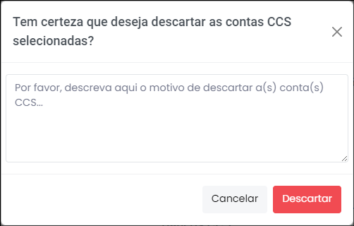
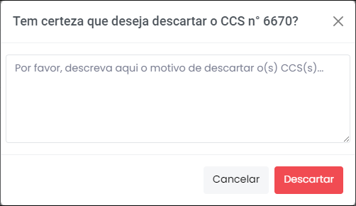

# Requisição  

 
*Figura 8 - Aba "Requisições".*   

Nesta aba é possível visualizar todas as requisições de CCS (cadastro de clientes do sistema financeiro nacional). CCS é a base de dados de todos os clientes do sistema financeiro brasileiro que envolvam relacionamento com instituições financeiras reguladas pelo Banco Central. Essa base é mantida pelo Banco Central e alimentada, obrigatoriamente, pelas instituições financeiras. 

## Fluxo
Ligado/Desligado Botão que indica o status atual da consulta automática ao Cadastro do Banco Central.   
Completar Fluxo Botão que finaliza a consulta automática ao Cadastro do Banco Central.   
Reiniciar Fluxo Botão que recomeça a consulta automática ao Cadastro do Banco Central.

## Detalhes da requisição 

Para acessar os detalhes de cada requisição, basta clicar no número da requisição (Figura 9). 

 
*Figura 9 - Acessar detalhes da requisição.*   

A partir da expansão dos detalhes da requisição, é possível identificar as contas por bancos, utilizando a caixa de seleção (Figura 10). 

 
*Figura 10 - Seleção de CCS por Bancos*  

## Descartar contas
É possível excluir as contas desnecessárias uma por uma ou selecionando todas as contas de uma vez só (Figura 11):

 
*Figura 11 - Excluir conta de Bancos*   

Ao clicar em deletar, uma janela será aberta com um campo de justificativa da exclusão - o registro é relevante quando o quarentenista, após algum tempo, quiser recuperar os dados ou saber a causa do descarte (Figura 12). 

 
*Figura 12 - Justificar exclusão de conta.*   

Realizada a exclusão, as contas descartadas ficam registradas e podem ser recuperadas a qualquer tempo (Figura 13): 

 
*Figura 13 - Contas descartadas do CCS vs. Recuperação.*   

Por fim, também é possível excluir toda a requisição, caso se julgue oportuno. Para isso, clique em "Descartar" (Figura 14). Ao clicar em "Descartar", uma janela será aberta com um campo de justificativa para o descarte (Figura 15). 

 
 
*Figura 14 - Descartar Requisição.* 

 
*Figura 15 - Justificar descarte de CCS.*   

Realizado o descarte, os CCS descartados ficam registrados e podem ser recuperadas a qualquer tempo (Figura 16):

 
*Figura 16 - CCS descartados vs. Recuperação.*   
