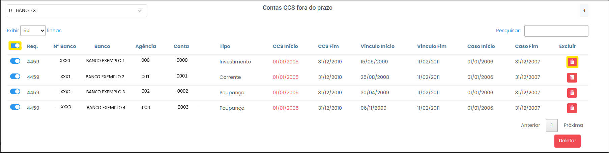
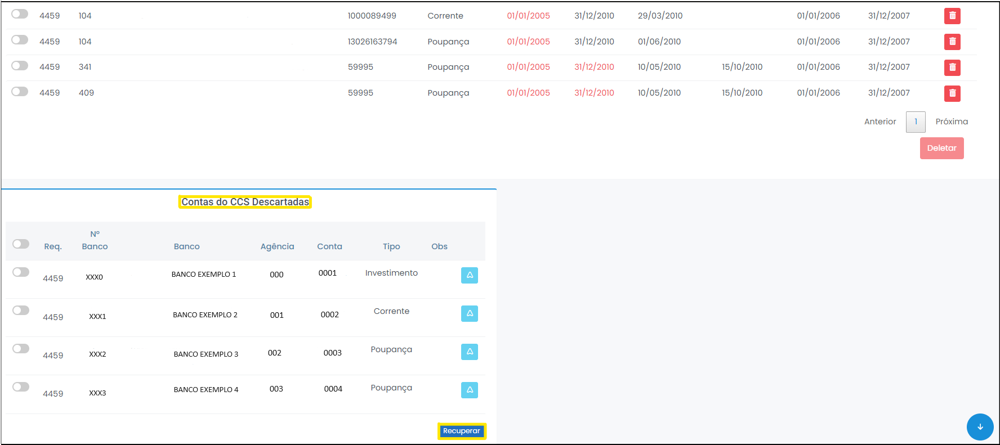

# Contas CCS fora do prazo

 
*Figura 17 - Aba "Contas CCS fora do prazo".*   

Nessa aba é possível visualizar todas as contas CCS fora do prazo, ordenáveis por bancos (Figura 18).

 
*Figura 18 - Contas CCS fora do prazo.*  

## Descartar contas
É possível excluir as contas desnecessárias uma por uma ou selecionando todas as contas de uma vez só (Figura 19):

 
*Figura 19 - Excluir contas CCS fora do prazo.*   

Ao clicar em deletar, uma janela será aberta com um campo de justificativa da exclusão - o registro é relevante quando o quarentenista, após algum tempo, quiser recuperar os dados ou saber a causa do descarte (Figura 20). 

 
*Figura 20 - Justificar exclusão de conta CCS.*   

Realizada a exclusão, as contas descartadas ficam registradas e podem ser recuperadas a qualquer tempo (Figura 21): 

 
*Figura 21 - Contas descartadas do CCS vs. Recuperação.*   

Realizado o descarte, os CCS descartados ficam registrados e podem ser recuperadas a qualquer tempo (Figura 22):

 
*Figura 22 - CCS descartados vs. Recuperação.*   
