# Atendimento

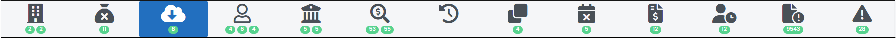 
*Figura 19 - Aba "Atendimento".*   

Nesta aba, encontram-se os procedimentos relacionados aos atendimentos dos bancos à determinação judicial. Os atendimentos são compostos das contas bancárias onde houve, eventualmente, a movimentação financeira objeto da análise. 

Quando se observar o recebimento de mais de uma carga do mesmo banco, será necessário compará-las para exclusão de cargas duplicadas. Assim, após a chegada de nova carga, constatados dados duplicados, deve-se excluir uma delas, seguindo os seguintes passos: 
 

1 Clique na aba "Atendimentos". 

2 Organize as cargas por ordem de Banco (Figura 20). 

 
*Figura 20 - Caixa de seleção de atendimentos para comparação de cargas.*   

3 Selecione os atendimentos que deseja comparar clicando sobre os ícones  <svg xmlns="http://www.w3.org/2000/svg" viewBox="0 0 576 512" width="20" height="20" style="vertical-align: middle;" ><!--! Font Awesome Pro 6.4.2 by @fontawesome - https://fontawesome.com License - https://fontawesome.com/license (Commercial License) Copyright 2023 Fonticons, Inc. --><path d="M384 128c70.7 0 128 57.3 128 128s-57.3 128-128 128H192c-70.7 0-128-57.3-128-128s57.3-128 128-128H384zM576 256c0-106-86-192-192-192H192C86 64 0 150 0 256S86 448 192 448H384c106 0 192-86 192-192zM192 352a96 96 0 1 0 0-192 96 96 0 1 0 0 192z" fill="currentColor" d="m21.68 17.65l-7-14a3 3 0 0 0-5.36 0l-7 14a3 3 0 0 0 3.9 4.08l5.37-2.4a1.06 1.06 0 0 1 .82 0l5.37 2.4a3 3 0 0 0 3.9-4.08Zm-2 2a1 1 0 0 1-1.13.22l-5.37-2.39a3 3 0 0 0-2.44 0L5.41 19.9a1 1 0 0 1-1.3-1.35l7-14a1 1 0 0 1 1.78 0l7 14a1 1 0 0 1-.17 1.13Z"/></svg>. O próprio Argus já sugere os atendimentos com contas idênticas ou similares! (Figura 21).

 
*Figura 21 - Selecionar atendimentos para comparação*.   

4 Para comparar os conteúdos dos lotes de contas (cargas bancárias), basta clicar em "Comparar" (Figura 22). 

 
*Figura 22 - Botão Comparar*.   

## Exclusão de dados

Ao comparar, haverá algumas possibilidades de exclusão de dados:  

 <strong> a) </strong> Exclusão de contas repetidas: selecionando as contas a serem rejeitadas, clicando sobre os ícones <svg xmlns="http://www.w3.org/2000/svg" viewBox="0 0 576 512" width="20" height="20" style="vertical-align: middle;" ><!--! Font Awesome Pro 6.4.2 by @fontawesome - https://fontawesome.com License - https://fontawesome.com/license (Commercial License) Copyright 2023 Fonticons, Inc. --><path d="M384 128c70.7 0 128 57.3 128 128s-57.3 128-128 128H192c-70.7 0-128-57.3-128-128s57.3-128 128-128H384zM576 256c0-106-86-192-192-192H192C86 64 0 150 0 256S86 448 192 448H384c106 0 192-86 192-192zM192 352a96 96 0 1 0 0-192 96 96 0 1 0 0 192z" fill="currentColor" d="m21.68 17.65l-7-14a3 3 0 0 0-5.36 0l-7 14a3 3 0 0 0 3.9 4.08l5.37-2.4a1.06 1.06 0 0 1 .82 0l5.37 2.4a3 3 0 0 0 3.9-4.08Zm-2 2a1 1 0 0 1-1.13.22l-5.37-2.39a3 3 0 0 0-2.44 0L5.41 19.9a1 1 0 0 1-1.3-1.35l7-14a1 1 0 0 1 1.78 0l7 14a1 1 0 0 1-.17 1.13Z"/></svg> e clicando no botão "Deletar" (Figura 23).

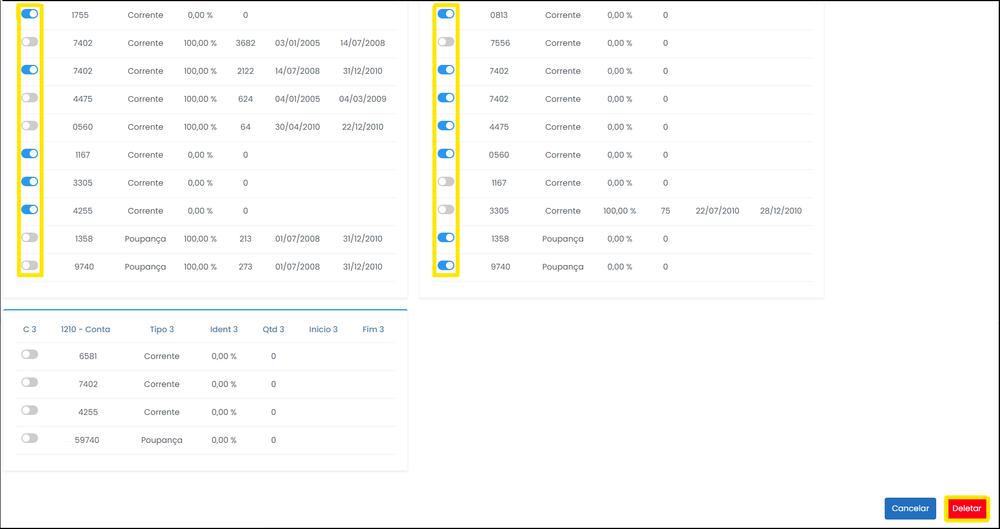 
*Figura 23 - Excluir atendimentos repetidos*.   

É necessário confirmar a exclusão das contas selecionadas (Figura 24). 

 
*Figura 24 - Confirmar operação*.   

 <strong> b) </strong> Excluir todo o atendimento, tendo em vista que são idênticos na quantidade e qualidade das contas (Figura 25). 

 
*Figura 25 - Atendimentos para exclusão*.   

 <strong> c) </strong> Por fim, outra possibilidade é excluir todo o atendimento na página principal da aba "Atendimentos", clicando na lixeira em cada linha desejada (Figura 26). 

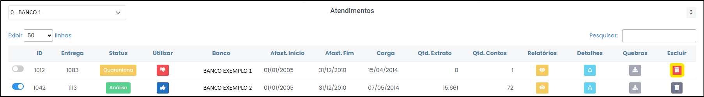 
*Figura 26 - Descartando pelo botão lixeira*.   

É importante fundamentar sua exclusão (Figura 27).  

 
*Figura 27 - Justificar exclusão do atendimento*.   

<svg height="35px" width="35px" style="vertical-align: middle" version="1.1" id="Layer_1" xmlns="http://www.w3.org/2000/svg" xmlns:xlink="http://www.w3.org/1999/xlink" viewBox="0 0 511.999 511.999" xml:space="preserve" fill="#000000" stroke="#000000"><g id="SVGRepo_bgCarrier" stroke-width="0"></g><g id="SVGRepo_tracerCarrier" stroke-linecap="round" stroke-linejoin="round"></g><g id="SVGRepo_iconCarrier"> <path style="fill:#F5C525;" d="M16.242,429.476L232.332,55.195c10.518-18.219,36.814-18.219,47.333,0l216.091,374.281 c10.518,18.219-2.63,40.991-23.666,40.991H39.908C18.872,470.467,5.723,447.695,16.242,429.476z"></path> <g> <path style="fill:#EFEFEF;" d="M255.999,322.45L255.999,322.45c-14.172,0-25.66-11.488-25.66-25.66V172.87 c0-14.172,11.488-25.66,25.66-25.66l0,0c14.172,0,25.66,11.488,25.66,25.66v123.92C281.659,310.962,270.171,322.45,255.999,322.45z "></path> <circle style="fill:#EFEFEF;" cx="256.001" cy="397.558" r="25.034"></circle> </g> <g> <path style="fill:#231F20;" d="M506.597,423.218L290.506,48.937C283.304,36.462,270.404,29.014,256,29.014 c-14.404,0-27.304,7.448-34.506,19.922L5.402,423.218c-7.202,12.475-7.202,27.37,0,39.845 c7.202,12.475,20.103,19.922,34.507,19.922h432.183c14.405,0,27.305-7.448,34.507-19.922 C513.799,450.588,513.799,435.692,506.597,423.218z M484.917,450.545c-1.286,2.227-5.108,7.405-12.826,7.405H39.908 c-7.718,0-11.541-5.178-12.826-7.405c-1.286-2.227-3.859-8.126,0-14.81L243.172,61.454c3.859-6.683,10.255-7.405,12.826-7.405 s8.967,0.722,12.826,7.405l216.091,374.281C488.775,442.419,486.201,448.318,484.917,450.545z"></path> <path style="fill:#231F20;" d="M255.999,134.692c-21.051,0-38.177,17.126-38.177,38.177v123.92 c0,21.051,17.126,38.178,38.177,38.178s38.177-17.126,38.177-38.177V172.87C294.176,151.818,277.05,134.692,255.999,134.692z M269.142,296.79c0,7.247-5.896,13.143-13.143,13.143s-13.143-5.896-13.143-13.143V172.87c0-7.247,5.896-13.143,13.143-13.143 s13.143,5.896,13.143,13.143V296.79z"></path> <path style="fill:#231F20;" d="M255.999,360.002c-20.706,0-37.552,16.846-37.552,37.552c0,20.706,16.846,37.552,37.552,37.552 s37.552-16.846,37.552-37.552C293.55,376.848,276.705,360.002,255.999,360.002z M255.999,410.071 c-6.902,0-12.517-5.615-12.517-12.517c0-6.902,5.615-12.517,12.517-12.517s12.517,5.615,12.517,12.517 C268.516,404.455,262.901,410.071,255.999,410.071z"></path> </g> </g></svg> Não é possível excluir atendimentos que estejam em análise!  

## Recuperar dados descartados

Todas as exclusões de atendimento ficam registradas e podem ser desfeitas (botão recuperar) durante o processo de tratamento de dados (Figura 28): 

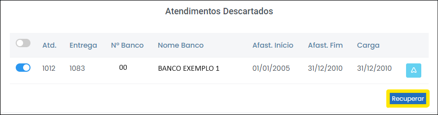 
*Figura 28 - Atendimentos descartados e o botão Recuperar*.   

 De igual maneira, as contas excluídas podem retornar para a plataforma pelo botão recuperar (Figura 29). 

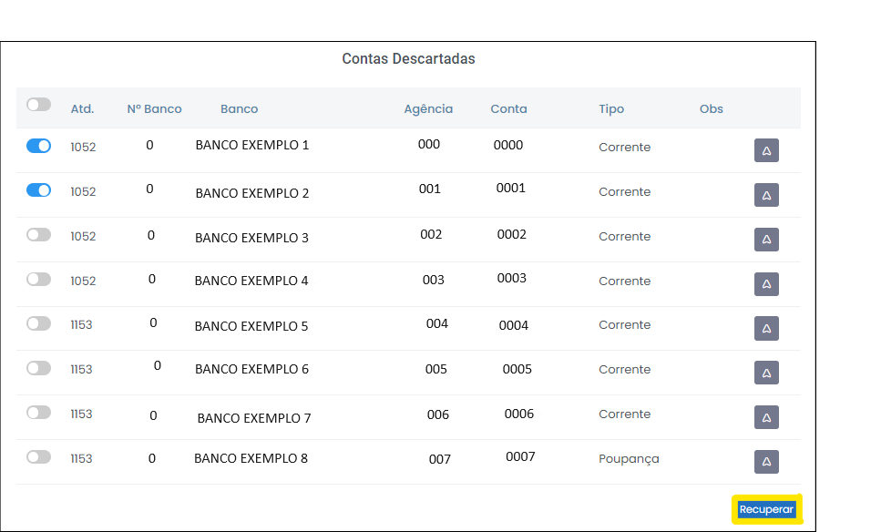 
*Figura 29 - Contas descartadas e o botão Recuperar*.   

 No decorrer da quarentena é possível ainda conferir a quantidade de cargas bancárias (os atendimentos) realizadas por todos os bancos. O ícone (Figura 30) encontra-se no canto superior direito da aba "Atendimentos'. 

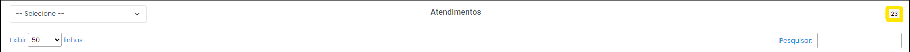 
*Figura 30 - Total de atendimentos*.   

## Relatório SIMBA

 O usuário pode acessar os 7 Relatórios Financeiros do Simba ao clicar no ícone (Figura 31): 

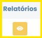 
*Figura 31 - Botão Relatórios*.   

<strong>Uso prático: </strong> Os relatórios são utilizados tanto no fim da quarentena (quando o solicitante pode acessar os dados bancários de forma estruturada e tomar decisões importantes sobre o andamento do seu procedimeto), quanto durante a conferência do teor dos extratos pelo quarentenista.   

Um exemplo prático são os casos de saques indevidos em conta de ex-pensionista falecida (corriqueiros no âmbito do Ministério Público Militar). Nessas investigações é importante garantir que a fonte pagadora (Exército, Marinha e Aeronáutica) esteja explícita nos extratos bancários. Confira a janela que se abre ao clicar no referido botão (Figura 32):

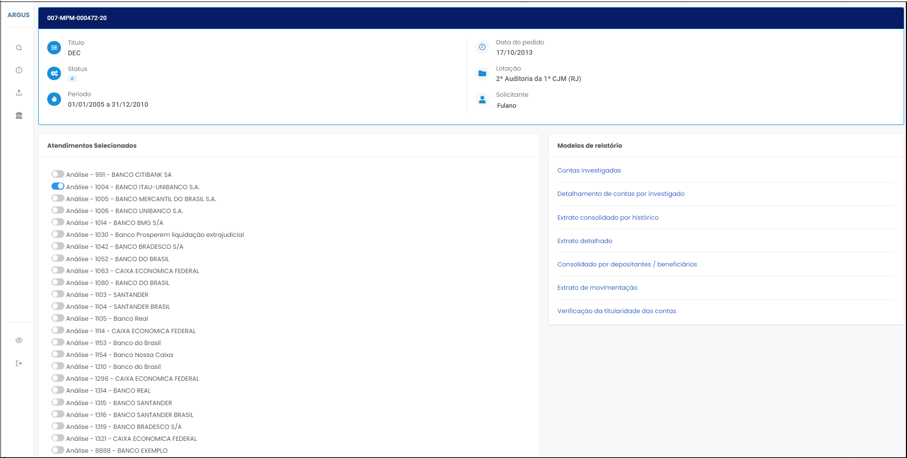 
*Figura 32 - Página de Relatórios*.   

 É possível visualizar os atendimentos selecionados e mudar os atendimentos escolhidos. Para alterar o atendimento, basta clicar no ícone <svg xmlns="http://www.w3.org/2000/svg" viewBox="0 0 576 512" width="20" height="20" style="vertical-align: middle;" ><!--! Font Awesome Pro 6.4.2 by @fontawesome - https://fontawesome.com License - https://fontawesome.com/license (Commercial License) Copyright 2023 Fonticons, Inc. --><path d="M384 128c70.7 0 128 57.3 128 128s-57.3 128-128 128H192c-70.7 0-128-57.3-128-128s57.3-128 128-128H384zM576 256c0-106-86-192-192-192H192C86 64 0 150 0 256S86 448 192 448H384c106 0 192-86 192-192zM192 352a96 96 0 1 0 0-192 96 96 0 1 0 0 192z" fill="currentColor" d="m21.68 17.65l-7-14a3 3 0 0 0-5.36 0l-7 14a3 3 0 0 0 3.9 4.08l5.37-2.4a1.06 1.06 0 0 1 .82 0l5.37 2.4a3 3 0 0 0 3.9-4.08Zm-2 2a1 1 0 0 1-1.13.22l-5.37-2.39a3 3 0 0 0-2.44 0L5.41 19.9a1 1 0 0 1-1.3-1.35l7-14a1 1 0 0 1 1.78 0l7 14a1 1 0 0 1-.17 1.13Z"/></svg> (Figura 33). 

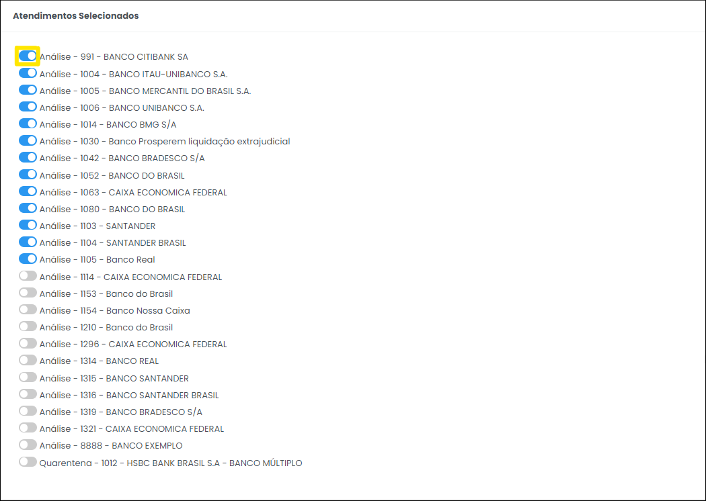 
*Figura 33 - Alternando Atendimentos*.   

 Ao todo, estão disponíveis os relatórios a seguir (Figura 34). 

 
*Figura 34 - Relatórios do Simba*.   

<strong>Uso prático: </strong> esses relatórios permitem ao solicitante o acesso a informações financeiras relevantes que podem subsidiar sua decisão antes mesmo da emissão do Relatório de Análise pelos peritos contábeis. 

Após o término do processo de quarentena, é natural que os atendimentos sejam encaminhados para a análise e os dados brutos baixados. Diante dessa necessidade, há algumas informações relevantes. 

## Exportar atendimentos

Para exportar os atendimentos para análise há duas opções:   

1 Exportação individual: 

Basta clicar no botão "Utilizar" (Figura 35). 

 
*Figura 35 - Botão Utilizar vermelho*.   

Ao clicar no botão, abrirá uma janela que te permitirá modificar o Status do atendimento para Análise. Para isso, basta clicar no botão em azul (Figura 36). 

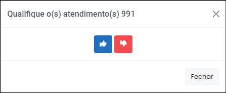 
*Figura 36 - Mudando atendimento para análise*.   

<svg height="35px" width="35px" style="vertical-align: middle" version="1.1" id="Layer_1" xmlns="http://www.w3.org/2000/svg" xmlns:xlink="http://www.w3.org/1999/xlink" viewBox="0 0 511.999 511.999" xml:space="preserve" fill="#000000" stroke="#000000"><g id="SVGRepo_bgCarrier" stroke-width="0"></g><g id="SVGRepo_tracerCarrier" stroke-linecap="round" stroke-linejoin="round"></g><g id="SVGRepo_iconCarrier"> <path style="fill:#F5C525;" d="M16.242,429.476L232.332,55.195c10.518-18.219,36.814-18.219,47.333,0l216.091,374.281 c10.518,18.219-2.63,40.991-23.666,40.991H39.908C18.872,470.467,5.723,447.695,16.242,429.476z"></path> <g> <path style="fill:#EFEFEF;" d="M255.999,322.45L255.999,322.45c-14.172,0-25.66-11.488-25.66-25.66V172.87 c0-14.172,11.488-25.66,25.66-25.66l0,0c14.172,0,25.66,11.488,25.66,25.66v123.92C281.659,310.962,270.171,322.45,255.999,322.45z "></path> <circle style="fill:#EFEFEF;" cx="256.001" cy="397.558" r="25.034"></circle> </g> <g> <path style="fill:#231F20;" d="M506.597,423.218L290.506,48.937C283.304,36.462,270.404,29.014,256,29.014 c-14.404,0-27.304,7.448-34.506,19.922L5.402,423.218c-7.202,12.475-7.202,27.37,0,39.845 c7.202,12.475,20.103,19.922,34.507,19.922h432.183c14.405,0,27.305-7.448,34.507-19.922 C513.799,450.588,513.799,435.692,506.597,423.218z M484.917,450.545c-1.286,2.227-5.108,7.405-12.826,7.405H39.908 c-7.718,0-11.541-5.178-12.826-7.405c-1.286-2.227-3.859-8.126,0-14.81L243.172,61.454c3.859-6.683,10.255-7.405,12.826-7.405 s8.967,0.722,12.826,7.405l216.091,374.281C488.775,442.419,486.201,448.318,484.917,450.545z"></path> <path style="fill:#231F20;" d="M255.999,134.692c-21.051,0-38.177,17.126-38.177,38.177v123.92 c0,21.051,17.126,38.178,38.177,38.178s38.177-17.126,38.177-38.177V172.87C294.176,151.818,277.05,134.692,255.999,134.692z M269.142,296.79c0,7.247-5.896,13.143-13.143,13.143s-13.143-5.896-13.143-13.143V172.87c0-7.247,5.896-13.143,13.143-13.143 s13.143,5.896,13.143,13.143V296.79z"></path> <path style="fill:#231F20;" d="M255.999,360.002c-20.706,0-37.552,16.846-37.552,37.552c0,20.706,16.846,37.552,37.552,37.552 s37.552-16.846,37.552-37.552C293.55,376.848,276.705,360.002,255.999,360.002z M255.999,410.071 c-6.902,0-12.517-5.615-12.517-12.517c0-6.902,5.615-12.517,12.517-12.517s12.517,5.615,12.517,12.517 C268.516,404.455,262.901,410.071,255.999,410.071z"></path> </g> </g></svg> Caso o botão esteja em azul, como ilustrado na figura 38, significa que o atendimento já está em análise! 

 
*Figura 37 - Botão Utilizar azul*.   

2 Exportação em bloco: 
 
Basta clicar no botão "Utilizar Todos", localizado no final da tabela (Figura 38). 

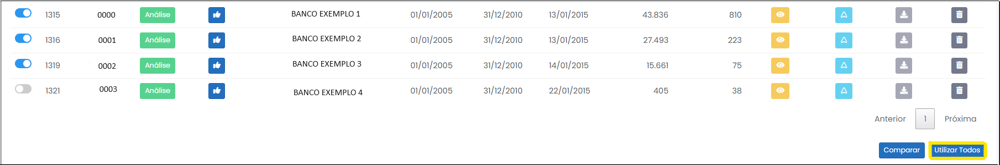 
*Figura 38 - Botão Utilizar Todos*.   

Ao clicar no botão, abrirá uma janela que te permitirá modificar o Status de todos os atendimentos para Análise. Para isso, basta clicar no botão em azul (Figura 39).

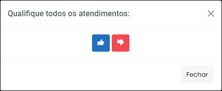 
*Figura 39 - Mudando atendimentos para análise*.   

 Por fim, é possível baixar os dados brutos ao fim do tratamento para disponibilização no PAI ou nos autos do processo (Figura 40). 

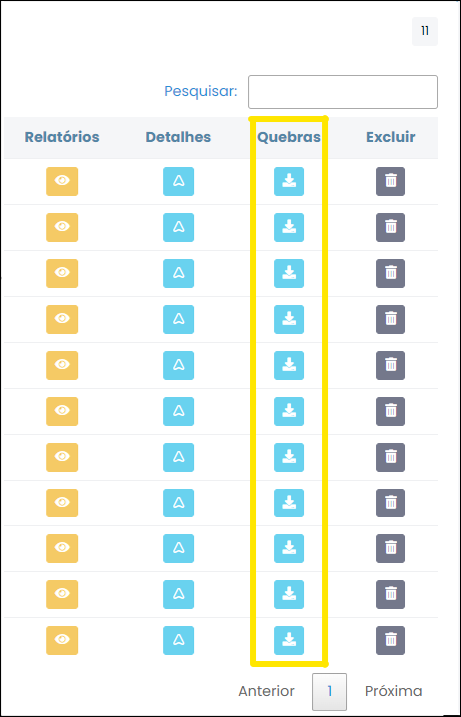 
*Figura 40 - Baixando os dados brutos*.   

