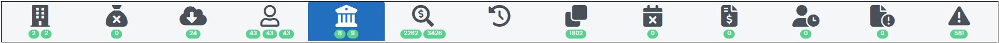
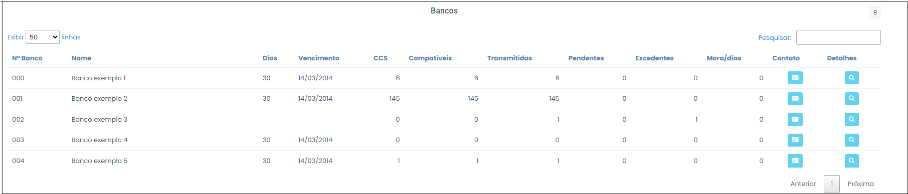

# Bancos

 
*Figura 45 - Aba "Bancos"*   

Nesta aba é possível monitorar as transmissões de dados por instituição, bem como acompanhar o tempo de atraso (mora). É importante notar que os números, em verde, abaixo do ícone (8, 9), indicam que há divergência entre os bancos arrolados no CCS e das entidades que remeteram dados ao Argus. 

## Tabela Bancos 
 
*Figura 46 -  Tabelas "Bancos".*  

Os dados são dispostos em colunas. O significado de cada coluna é o seguinte: 

<ul style="text-align: justify;" >
<li><strong>Nº Banco: </strong>  código que a instituição financeira se identifica junto ao Banco Central.  </li>
<li><strong>Nome:</strong> nome do banco. </li>
<li><strong>Dias: </strong> prazo padronizado para os bancos encaminharem os dados. Após esse prazo, o banco se encontra em atraso (mora).</li>
<li><strong>Vencimento: </strong> data final para encaminhamento dos dados bancários. Após essa data, o banco se encontra em atraso (mora). </li>
<li><strong>CCS : </strong>  base de dados de todos os clientes do sistema financeiro brasileiro que envolvam relacionamento com instituições financeiras reguladas pelo Banco Central. </li>
<li><strong>Compatíveis: </strong> contas efetivamente encaminhadas pelas instituições financeiras e compatíveis com os dados do CCS. </li> 
<li><strong>Transmitidas: </strong>contas efetivamente encaminhadas pelas instituições financeiras.</li>
<li><strong>Pendentes: </strong>contas não encaminhadas pelas instituições financeiras e constantes do CCS. </li>
<li><strong>Excedentes: </strong>contas efetivamente encaminhadas pelas instituições financeiras e além do CCS.  </li>
<li><strong>Mora/dias: </strong> não cumprimento da obrigação judicial de encaminhar os dados bancários (é contada a partir do vencimento do prazo regulamentar de 30 dias).</li>
<li><strong>Contato:</strong> telefone e e-mail do funcionário do banco que realizou a transmissão do dado bancário. É bastante últil para acionar especificamente a pessoa responsável por aquele dado. (Figura 47). </strong> </li>
</ul>

 
*Figura 47 -  Contato do responsável pela transmissão dos dados.*  
 
<ul style="text-align: justify;" >
<li><strong>Detalhes: </strong>lista de contas por investigado de determinada instituição financeira com informações sobre o CPF/CNPJ, nome, agência, número da conta, tipo de conta, percentual de identificação das operações, quantidade de linhas nos extratos, início e fim de movimentação e a situação (enviada, não enviada e excedente).  </li>
</ul>

