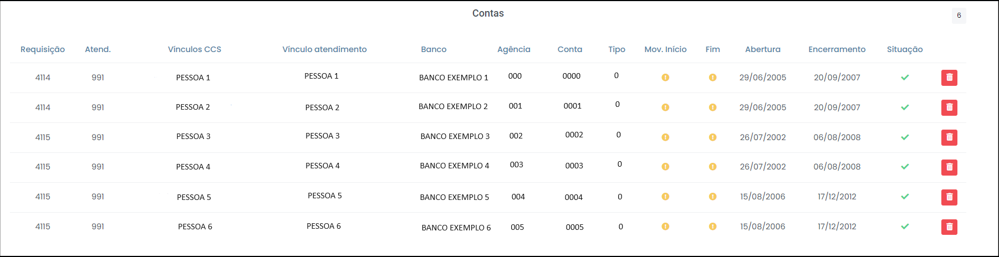
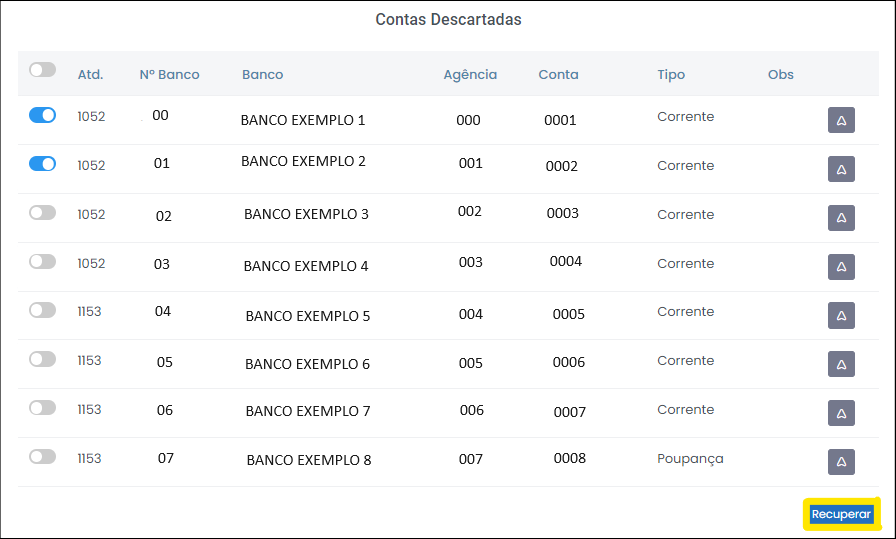

# Conta

 
*Figura 48 - Aba "Conta"*  

## Tabela Bancos

A aba "Contas" traz a tabela "Bancos" (Figura 49): 

 
*Figura 49 - Tabela Bancos*  

Esta tabela contêm as seguintes informações: 

<ul style="text-align: justify;" >
<li><strong>Nº Banco: </strong>  código que a instituição financeira se identifica junto ao Banco Central.  </li>
<li><strong>Nome:</strong> nome do banco. </li>
<li><strong>CCS : </strong>  base de dados de todos os clientes do sistema financeiro brasileiro que envolvam relacionamento com instituições financeiras reguladas pelo Banco Central. </li>
<li><strong>Transmitidas: </strong>contas efetivamente encaminhadas pelas instituições financeiras.</li>
<li><strong>Pendentes: </strong>contas não encaminhadas pelas instituições financeiras e constantes do CCS. </li>
<li><strong>Excedentes: </strong>contas efetivamente encaminhadas pelas instituições financeiras e além do CCS.  </li>
<li><strong>Compatíveis: </strong> contas efetivamente encaminhadas pelas instituições financeiras e compatíveis com os dados do CCS. </li> 
<li><strong>Contato:</strong> telefone e e-mail do funcionário do banco que realizou a transmissão do dado bancário. É bastante últil para acionar especificamente a pessoa responsável por aquele dado.</li>
</ul>
 
## Detalhes das Contas

 Além disso, na tabela "Bancos" também é possível consultar os detalhes das contas de cada banco. Por exemplo, caso deseje saber as contas transmitidas pelo Banco Citibank, basta ir na coluna "transmitidas" referente ao banco e clicar no número 6 para detalhar (Figura 49). 

Em seguida, uma janela será aberta com o respectivo detalhamento daquela conta (Figura 50). 

 
*Figura 50 - Detalhe da conta.*  

A janela de detalhes engloba as seguintes informações: 

<ul style="text-align: justify;" >
<li><strong>Requisição: </strong> demanda dos dados do investigado. </li>
<li><strong>Atendimento:</strong> resposta das instituições financeiras acerca dos dados demandados. Geralmente cada atendimento comporta um lote de contas de determinado banco.</li>
<li><strong>Vínculos CCS:</strong> nomes das pessoas que tem relacionamento com algum banco integrado ao sistema financeiro. Os vínculos podem aglomerar diversas grafias ou abreviaturas de nomes relacionados àquelas pessoas.</li>
<li><strong>Vínculo atendimento:</strong> nomes atribuídos aos investigados pelas instituições financeiras no momento da transmissão de dados.</li>
<li><strong>Banco:</strong> nome do banco.  </li>
<li><strong>Agência:</strong> agência do banco.</li> 
<li><strong>Conta:</strong> refere-se ao número único atribuído à conta bancária.</li>
<li><strong>Tipo:</strong> indica o tipo de conta bancária (conta corrente, conta poupança, conta investimento entre outros).</li>
<li><strong>Mov. Início:</strong> data em que foram iniciadas as movimentações ou transações na conta bancária.</li>
<li><strong>Fim:</strong> data em que as movimentações ou transações na conta bancária cessaram. </li>
<li><strong>Abertura:</strong>data em que a conta bancária foi aberta oficialmente e registrada no sistema do banco.</li>
<li><strong>Encerramento:</strong>data em que a conta bancária foi fechada e todos os seus serviços e associações foram encerrados.</li>
<li><strong>Situação:</strong> estado da conta em relação à demanda (compatível com a solicitação, excendente à solicitação e não encaminhada).</li>
<li><strong>Descartar conta:</strong> ao clicar no ícone  <?xml version="1.0" encoding="UTF-8"?><!-- Generator: Adobe Illustrator 25.0.0, SVG Export Plug-In . SVG Version: 6.00 Build 0)  --><svg xmlns="http://www.w3.org/2000/svg" xmlns:xlink="http://www.w3.org/1999/xlink" version="1.1" id="Capa_1" x="0px" y="0px" viewBox="0 0 512 512" style="enable-background:new 0 0 512 512;" xml:space="preserve" width="20" height="20"><g><path d="M490.667,96c0-17.673-14.327-32-32-32h-80.555C364.632,25.757,328.549,0.13,288,0h-64   c-40.549,0.13-76.632,25.757-90.112,64H53.333c-17.673,0-32,14.327-32,32l0,0c0,17.673,14.327,32,32,32H64v266.667   C64,459.468,116.532,512,181.333,512h149.333C395.468,512,448,459.468,448,394.667V128h10.667   C476.34,128,490.667,113.673,490.667,96z M384,394.667C384,424.122,360.122,448,330.667,448H181.333   C151.878,448,128,424.122,128,394.667V128h256V394.667z" fill="currentColor" d="m21.68 17.65l-7-14a3 3 0 0 0-5.36 0l-7 14a3 3 0 0 0 3.9 4.08l5.37-2.4a1.06 1.06 0 0 1 .82 0l5.37 2.4a3 3 0 0 0 3.9-4.08Zm-2 2a1 1 0 0 1-1.13.22l-5.37-2.39a3 3 0 0 0-2.44 0L5.41 19.9a1 1 0 0 1-1.3-1.35l7-14a1 1 0 0 1 1.78 0l7 14a1 1 0 0 1-.17 1.13Z"/><path d="M202.667,384c17.673,0,32-14.327,32-32V224c0-17.673-14.327-32-32-32s-32,14.327-32,32v128   C170.667,369.673,184.994,384,202.667,384z" fill="currentColor" d="m21.68 17.65l-7-14a3 3 0 0 0-5.36 0l-7 14a3 3 0 0 0 3.9 4.08l5.37-2.4a1.06 1.06 0 0 1 .82 0l5.37 2.4a3 3 0 0 0 3.9-4.08Zm-2 2a1 1 0 0 1-1.13.22l-5.37-2.39a3 3 0 0 0-2.44 0L5.41 19.9a1 1 0 0 1-1.3-1.35l7-14a1 1 0 0 1 1.78 0l7 14a1 1 0 0 1-.17 1.13Z"/><path d="M309.333,384c17.673,0,32-14.327,32-32V224c0-17.673-14.327-32-32-32s-32,14.327-32,32v128   C277.333,369.673,291.66,384,309.333,384z" fill="currentColor" d="m21.68 17.65l-7-14a3 3 0 0 0-5.36 0l-7 14a3 3 0 0 0 3.9 4.08l5.37-2.4a1.06 1.06 0 0 1 .82 0l5.37 2.4a3 3 0 0 0 3.9-4.08Zm-2 2a1 1 0 0 1-1.13.22l-5.37-2.39a3 3 0 0 0-2.44 0L5.41 19.9a1 1 0 0 1-1.3-1.35l7-14a1 1 0 0 1 1.78 0l7 14a1 1 0 0 1-.17 1.13Z"/></g></svg> é possível descartar as contas desejadas. Todas as exclusões de contas e contas do CCS ficam registradas e podem ser desfeitas (botão recuperar) conta por conta ou todas de uma vez só (Figura 51), a qualquer momento. 
</li></ul>

 
*Figura 51 - Recuperar Contas Descartadas.*  

