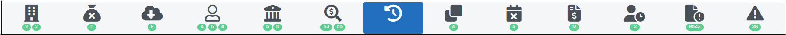
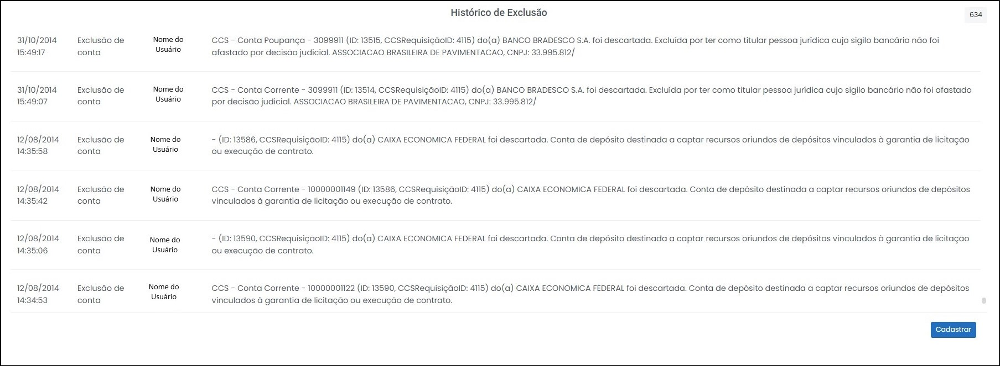
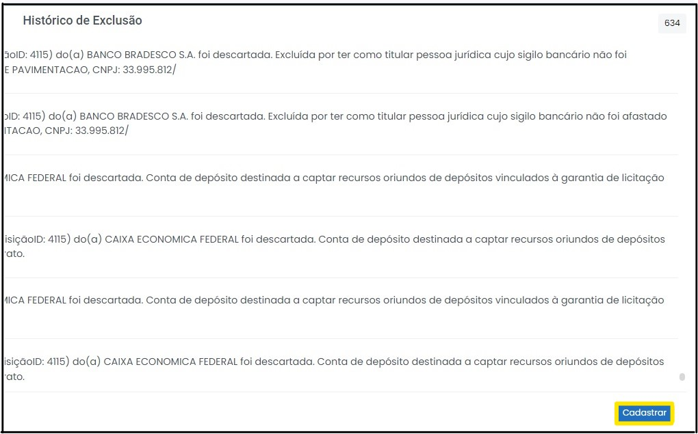
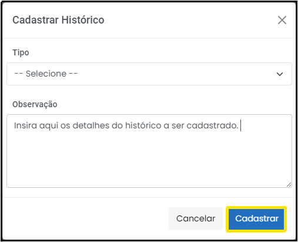

# Histórico

 
*Figura 52 - Aba "Histórico".*   

Nesta aba é possível visualizar uma listagem de todo o histórico de ações do caso.

 
*Figura 53 - Lista de histórico.*   

Além disso, também é possível cadastrar um novo histório do caso, clicando no botão Cadastrar (Figura 54).  

 
*Figura 54 - Botão de cadastrar histórico.*   

Logo após, uma janela será aberta solicitando ao usuário que informe o tipo de histórico a ser cadastrado e a descrição de tal histórico (Figura 55). Por fim, basta confirmar a operação clicando em "Cadastrar". 

 
*Figura 55 - Cadastrando histórico.*   

