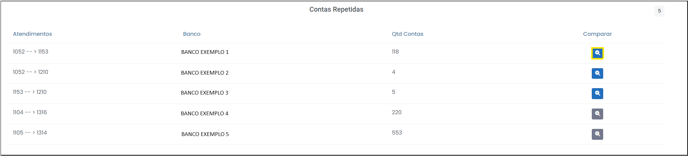

# Contas Repetidas

 
*Figura 56 - Aba "Contas Repetidas".*   

A aba "Contas Repetidas" indica quais lotes de contas (atendimentos) estão repetidos para cada banco.

 
*Figura 57 - Tabela "Contas Repetidas".*   

Nesta aba é possível comparar as contas repetidas. Ao comparar, haverá algumas possibilidades de exclusão de dados:

 <strong> a) </strong> Exclusão de contas repetidas: selecionando as contas a serem rejeitadas, clicando sobre os ícones <svg xmlns="http://www.w3.org/2000/svg" viewBox="0 0 576 512" width="20" height="20" style="vertical-align: middle;" ><!--! Font Awesome Pro 6.4.2 by @fontawesome - https://fontawesome.com License - https://fontawesome.com/license (Commercial License) Copyright 2023 Fonticons, Inc. --><path d="M384 128c70.7 0 128 57.3 128 128s-57.3 128-128 128H192c-70.7 0-128-57.3-128-128s57.3-128 128-128H384zM576 256c0-106-86-192-192-192H192C86 64 0 150 0 256S86 448 192 448H384c106 0 192-86 192-192zM192 352a96 96 0 1 0 0-192 96 96 0 1 0 0 192z" fill="currentColor" d="m21.68 17.65l-7-14a3 3 0 0 0-5.36 0l-7 14a3 3 0 0 0 3.9 4.08l5.37-2.4a1.06 1.06 0 0 1 .82 0l5.37 2.4a3 3 0 0 0 3.9-4.08Zm-2 2a1 1 0 0 1-1.13.22l-5.37-2.39a3 3 0 0 0-2.44 0L5.41 19.9a1 1 0 0 1-1.3-1.35l7-14a1 1 0 0 1 1.78 0l7 14a1 1 0 0 1-.17 1.13Z"/></svg> e clicando no botão "Deletar" (Figura 58).

 
*Figura 58 - Excluir contas repetidas.*   

É necessário confirmar a exclusão das contas selecionadas (Figura 59).

 
*Figura 59 - Confirmar operação.*   

<strong> b) </strong> Excluir todo o atendimento, tendo em vista que são idênticos na quantidade e qualidade das contas (Figura 60). 

 
*Figura 60 - Contas para exclusão*.   

É importante fundamentar sua exclusão (Figura 61). 

 
*Figura 61 - Justificar exclusão de conta*.   

<svg height="35px" width="35px" style="vertical-align: middle" version="1.1" id="Layer_1" xmlns="http://www.w3.org/2000/svg" xmlns:xlink="http://www.w3.org/1999/xlink" viewBox="0 0 511.999 511.999" xml:space="preserve" fill="#000000" stroke="#000000"><g id="SVGRepo_bgCarrier" stroke-width="0"></g><g id="SVGRepo_tracerCarrier" stroke-linecap="round" stroke-linejoin="round"></g><g id="SVGRepo_iconCarrier"> <path style="fill:#F5C525;" d="M16.242,429.476L232.332,55.195c10.518-18.219,36.814-18.219,47.333,0l216.091,374.281 c10.518,18.219-2.63,40.991-23.666,40.991H39.908C18.872,470.467,5.723,447.695,16.242,429.476z"></path> <g> <path style="fill:#EFEFEF;" d="M255.999,322.45L255.999,322.45c-14.172,0-25.66-11.488-25.66-25.66V172.87 c0-14.172,11.488-25.66,25.66-25.66l0,0c14.172,0,25.66,11.488,25.66,25.66v123.92C281.659,310.962,270.171,322.45,255.999,322.45z "></path> <circle style="fill:#EFEFEF;" cx="256.001" cy="397.558" r="25.034"></circle> </g> <g> <path style="fill:#231F20;" d="M506.597,423.218L290.506,48.937C283.304,36.462,270.404,29.014,256,29.014 c-14.404,0-27.304,7.448-34.506,19.922L5.402,423.218c-7.202,12.475-7.202,27.37,0,39.845 c7.202,12.475,20.103,19.922,34.507,19.922h432.183c14.405,0,27.305-7.448,34.507-19.922 C513.799,450.588,513.799,435.692,506.597,423.218z M484.917,450.545c-1.286,2.227-5.108,7.405-12.826,7.405H39.908 c-7.718,0-11.541-5.178-12.826-7.405c-1.286-2.227-3.859-8.126,0-14.81L243.172,61.454c3.859-6.683,10.255-7.405,12.826-7.405 s8.967,0.722,12.826,7.405l216.091,374.281C488.775,442.419,486.201,448.318,484.917,450.545z"></path> <path style="fill:#231F20;" d="M255.999,134.692c-21.051,0-38.177,17.126-38.177,38.177v123.92 c0,21.051,17.126,38.178,38.177,38.178s38.177-17.126,38.177-38.177V172.87C294.176,151.818,277.05,134.692,255.999,134.692z M269.142,296.79c0,7.247-5.896,13.143-13.143,13.143s-13.143-5.896-13.143-13.143V172.87c0-7.247,5.896-13.143,13.143-13.143 s13.143,5.896,13.143,13.143V296.79z"></path> <path style="fill:#231F20;" d="M255.999,360.002c-20.706,0-37.552,16.846-37.552,37.552c0,20.706,16.846,37.552,37.552,37.552 s37.552-16.846,37.552-37.552C293.55,376.848,276.705,360.002,255.999,360.002z M255.999,410.071 c-6.902,0-12.517-5.615-12.517-12.517c0-6.902,5.615-12.517,12.517-12.517s12.517,5.615,12.517,12.517 C268.516,404.455,262.901,410.071,255.999,410.071z"></path> </g> </g></svg> Não é possível excluir contas de atendimentos que estejam em análise!  