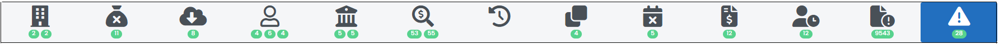
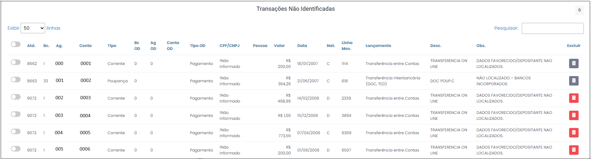
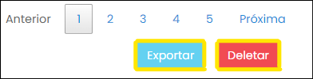

# Transações Não Identificadas

 
*Figura 66 - Aba "Transações Não Identificadas".*   

Esta aba mostra as operações que deveriam ser obrigatoriamente identificadas quanto aos beneficiários ou depositantes. É possível realizar uma filtragem dos dados que serão apresentados na tabela para facilitar a análise (Figura 67). Basta selecionar os campos desejados e clicar no botão "Filtrar".

 
*Figura 67 - Filtrar tabela.*  

Os dados são dispostos em colunas na tabela (Figura 68).

 
*Figura 68 - Tabela "Transações Não Identificadas".*   

 O significado de cada coluna é o seguinte: 

<ul style="text-align: justify;" >
<li><strong>Atd.:</strong> número identificador da transação.</li>
<li><strong>Bc.:</strong> número identificador do banco no sistema financeiro. </li>
<li><strong>Ag.: </strong> agência do banco.</li>
<li><strong>Conta: </strong>refere-se ao número único atribuído à conta bancária. </li>
<li><strong>Tipo: </strong> indica o tipo de conta bancária (conta corrente, conta poupança, conta investimento entre outros).</li>
<li><strong>Bc OD: </strong> indica o banco de origem ou destino da operação, ou seja, o banco ou do beneficiário ou do depositante daquela transação. </li> 
<li><strong>Ag OD: </strong> indica a agencia do banco de origem ou destino da operação, ou seja, a agencia ou do beneficiário ou do depositante daquela transação.</li>
<li><strong>Conta OD: </strong> indica a conta de origem ou destino da operação, ou seja, a conta ou do beneficiário ou do depositante daquela transação. </li>
<li><strong>Tipo OD: </strong> tipo da conta de origem ou destino da operação (pagamento, corrente, poupança, investimento...).</li>
<li><strong>CPF/CNPJ: </strong> nº de cadastro que identifica a pessoa junto a receita federal. </li>
<li><strong>Pessoa:</strong>  nome do beneficiário ou depositante da operação financeira. </li>
<li><strong>Valor:</strong> valor da operação financeira.  </li>
<li><strong>Data:</strong> data da operação financeira. </li>
<li><strong>Nat.:</strong> natureza contábil da operação, se é débito (D) ou crédito (C).   </li>
<li><strong>OD:</strong>   </li>
<li><strong>Ext.:</strong> número da linha do extrato onde está registrada a operação. </li>
<li><strong>Lançamento:</strong> título dado à operação. </li>
<li><strong>Desc.:</strong> detalhamento do lançamento.  </li>
<li><strong>Obs.:</strong> informações adicionais sobre a operação.  </li>

<svg height="35px" width="25px" style="vertical-align: middle" version="1.1" id="Layer_1" xmlns="http://www.w3.org/2000/svg" xmlns:xlink="http://www.w3.org/1999/xlink" viewBox="0 0 511.999 511.999" xml:space="preserve" fill="#000000" stroke="#000000"><g id="SVGRepo_bgCarrier" stroke-width="0"></g><g id="SVGRepo_tracerCarrier" stroke-linecap="round" stroke-linejoin="round"></g><g id="SVGRepo_iconCarrier"> <path style="fill:#F5C525;" d="M16.242,429.476L232.332,55.195c10.518-18.219,36.814-18.219,47.333,0l216.091,374.281 c10.518,18.219-2.63,40.991-23.666,40.991H39.908C18.872,470.467,5.723,447.695,16.242,429.476z"></path> <g> <path style="fill:#EFEFEF;" d="M255.999,322.45L255.999,322.45c-14.172,0-25.66-11.488-25.66-25.66V172.87 c0-14.172,11.488-25.66,25.66-25.66l0,0c14.172,0,25.66,11.488,25.66,25.66v123.92C281.659,310.962,270.171,322.45,255.999,322.45z "></path> <circle style="fill:#EFEFEF;" cx="256.001" cy="397.558" r="25.034"></circle> </g> <g> <path style="fill:#231F20;" d="M506.597,423.218L290.506,48.937C283.304,36.462,270.404,29.014,256,29.014 c-14.404,0-27.304,7.448-34.506,19.922L5.402,423.218c-7.202,12.475-7.202,27.37,0,39.845 c7.202,12.475,20.103,19.922,34.507,19.922h432.183c14.405,0,27.305-7.448,34.507-19.922 C513.799,450.588,513.799,435.692,506.597,423.218z M484.917,450.545c-1.286,2.227-5.108,7.405-12.826,7.405H39.908 c-7.718,0-11.541-5.178-12.826-7.405c-1.286-2.227-3.859-8.126,0-14.81L243.172,61.454c3.859-6.683,10.255-7.405,12.826-7.405 s8.967,0.722,12.826,7.405l216.091,374.281C488.775,442.419,486.201,448.318,484.917,450.545z"></path> <path style="fill:#231F20;" d="M255.999,134.692c-21.051,0-38.177,17.126-38.177,38.177v123.92 c0,21.051,17.126,38.178,38.177,38.178s38.177-17.126,38.177-38.177V172.87C294.176,151.818,277.05,134.692,255.999,134.692z M269.142,296.79c0,7.247-5.896,13.143-13.143,13.143s-13.143-5.896-13.143-13.143V172.87c0-7.247,5.896-13.143,13.143-13.143 s13.143,5.896,13.143,13.143V296.79z"></path> <path style="fill:#231F20;" d="M255.999,360.002c-20.706,0-37.552,16.846-37.552,37.552c0,20.706,16.846,37.552,37.552,37.552 s37.552-16.846,37.552-37.552C293.55,376.848,276.705,360.002,255.999,360.002z M255.999,410.071 c-6.902,0-12.517-5.615-12.517-12.517c0-6.902,5.615-12.517,12.517-12.517s12.517,5.615,12.517,12.517 C268.516,404.455,262.901,410.071,255.999,410.071z"></path> </g> </g></svg> " !Não informado " : as informações de origem e destino não foram informadas pelo banco. 

</ul>

Botões 

 
*Figura 69 - Botões.*  

No final da tabela estão os botões "Exportar" e "Deletar", onde: 

<ul style="text-align: justify;" >
<li><strong>Exportar: </strong> usado para quando se deseja exportar os dados para formatos editável em Excel, com o ojetivo de facilitar a cobrança de identificação dos lançamentos. </li>
<li><strong>Deletar: </strong> usado quando se deseja descartar o(s) atendimento(s), sendo necessário descrever qual foi a motivação. </li>
</ul>
