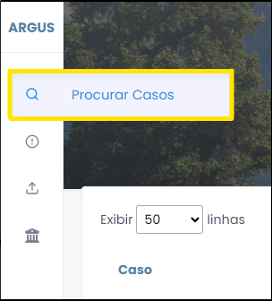
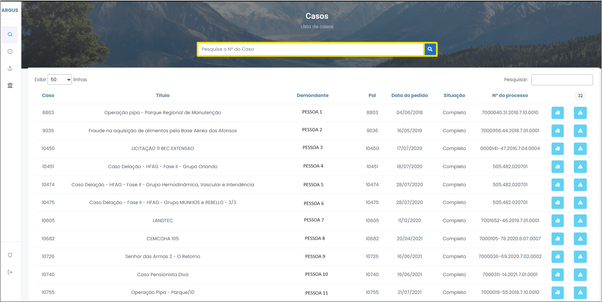

# Procurar casos 

1 Para pesquisar um caso, clique na lupa contida na barra lateral de Menu (Figura 6). 

 
*Figura 6 - Procurar casos.*   

2 A pesquisa permite encontrar um caso pelo número Nº do Caso (Figura 7). 

 
*Figura 6 - Pesquisar caso a partir de seu número.*   

