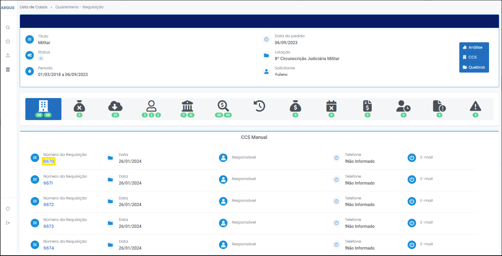
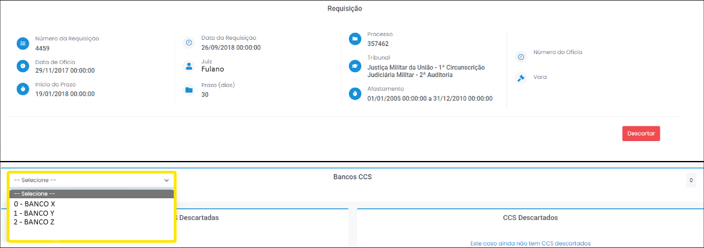
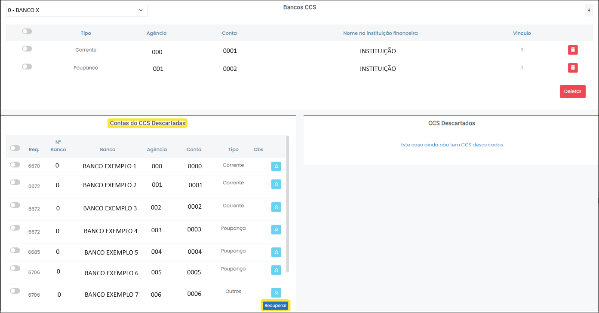
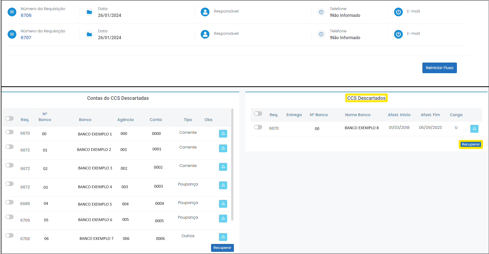
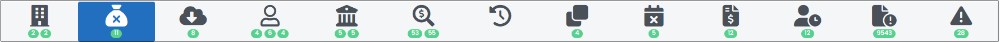
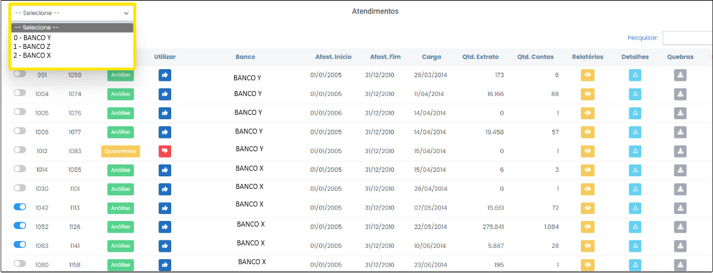
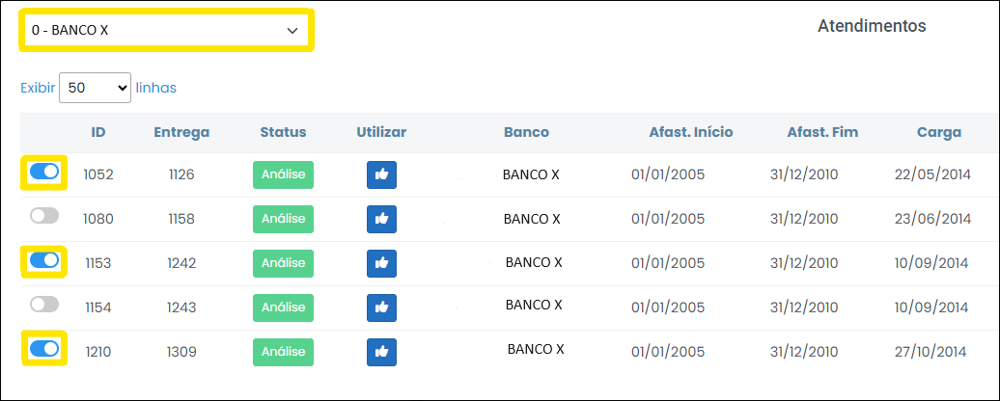

# Iniciando o processo de quarentena 

1 Para pesquisar um caso desejado, digite o N° do Caso no campo localizado no centro da página (Figura 6). 

 
*Figura 6 - Procurar casos.*   

2 Em seguida, clique em "Acessar Quarentena", no pedido desejado (Figura 7). 

 
*Figura 7 - Acessar Quarentena.*   

 Na página aberta, é possível visualizar o título, o status, o período e a data do pedido do caso, além da lotação e o nome do solicitante (Figura 8). 

 
*Figura 8 - Informações básicas do caso.*   

##  Requisição  

 
*Figura 9 - Requisições.*   

Nesta aba é possível visualizar todas as ---REQUISIÇÕES?--- de ---CCS?---. Para acessar os detalhes de cada requisição, basta clicar no número da requisição (Figura 10). 

 
*Figura 10 - Acessar detalhes da requisição.*   

A partir da expansão dos detalhes da requisição, é possível identificar as contas por bancos, utilizando a caixa de seleção (Figura 11). 

 
*Figura 11 - Seleção de CCS por Bancos*   

É possível excluir as contas desnecessárias uma por uma ou selecionando todas as contas de uma vez só (Figura 12):

 
*Figura 12 - Excluir conta de Bancos*   

Ao clicar em deletar, uma janela será aberta com um campo de justificativa da exclusão - o registro é relevante quando o quarentenista, após algum tempo, quiser recuperar os dados ou saber a causa do descarte (Figura 13). 

 
*Figura 13 - Justificar exclusão de conta.*   

Realizada a exclusão, as contas descartadas ficam registradas e podem ser recuperadas a qualquer tempo (Figura 14): 

 
*Figura 14 - Contas descartadas do CCS vs. Recuperação.*   

Por fim, também é possível excluir toda a requisição, caso se julgue oportuno. Para isso, clique em "Descartar" (Figura 15). Ao clicar em "Descartar", uma janela será aberta com um campo de justificativa para o descarte (Figura 16). 

 
 
*Figura 15 - Descartar Requisição.* 

 
*Figura 16 - Justificar descarte de CCS.*   

Realizado o descarte, os CCS descartados ficam registrados e podem ser recuperadas a qualquer tempo (Figura 17):

 
*Figura 17 - CCS descartados vs. Recuperação.*   

##  Contas CCS fora do prazo  

 
*Figura 18 - Contas CCS fora do prazo.*   

Nessa aba é possível visualizar todas as contas CCS fora do prazo, ordenáveis por bancos (Figura 19).

 
*Figura 19 - Contas CCS fora do prazo.*   

--- FINALIZAR PARTE DE DESCARTAR, QUE AINDA NÃO ESTÁ NO SISTEMA 

##  Atendimento  

 
*Figura 20 - Atendimento.*   

Nesta aba, encontram-se os procedimentos relacionados aos atendimentos dos bancos à determinação judicial. Os atendimentos são compostos das contas bancárias onde houve, eventualmente, a movimentação financeira objeto da análise. 

Quando se observar o recebimento de mais de uma carga do mesmo banco, será necessário compará-las para exclusão de cargas duplicadas. Assim, após a chegada de nova carga, constatados dados duplicados, deve-se excluir uma delas, seguindo os seguintes passos: 

1 Clique na aba "Atendimentos". 

2 Organize as cargas por ordem de Banco (Figura 21). 

 
*Figura 21 - Caixa de seleção de atendimentos para comparação de cargas.*   

3 Selecione os atendimentos que deseja comparar clicando sobre os ícones  <svg xmlns="http://www.w3.org/2000/svg" viewBox="0 0 576 512" width="20" height="20" style="vertical-align: middle;" ><!--! Font Awesome Pro 6.4.2 by @fontawesome - https://fontawesome.com License - https://fontawesome.com/license (Commercial License) Copyright 2023 Fonticons, Inc. --><path d="M384 128c70.7 0 128 57.3 128 128s-57.3 128-128 128H192c-70.7 0-128-57.3-128-128s57.3-128 128-128H384zM576 256c0-106-86-192-192-192H192C86 64 0 150 0 256S86 448 192 448H384c106 0 192-86 192-192zM192 352a96 96 0 1 0 0-192 96 96 0 1 0 0 192z" fill="currentColor" d="m21.68 17.65l-7-14a3 3 0 0 0-5.36 0l-7 14a3 3 0 0 0 3.9 4.08l5.37-2.4a1.06 1.06 0 0 1 .82 0l5.37 2.4a3 3 0 0 0 3.9-4.08Zm-2 2a1 1 0 0 1-1.13.22l-5.37-2.39a3 3 0 0 0-2.44 0L5.41 19.9a1 1 0 0 1-1.3-1.35l7-14a1 1 0 0 1 1.78 0l7 14a1 1 0 0 1-.17 1.13Z"/></svg>. O próprio Argus já sugere os atendimentos com contas idênticas ou similares! (Figura 22).

 
*Figura 22 - Selecionar atendimentos para comparação*.   

4 Para comparar os conteúdos dos lotes de contas (cargas bancárias), basta clicar em "Comparar" (Figura 23). 

 
*Figura 23 - Botão Comparar*.   

Ao comparar, haverá algumas possibilidades de exclusão de dados:  

 <strong> a) </strong> Exclusão de contas repetidas: selecionando as contas a serem rejeitadas, clicando sobre os ícones <svg xmlns="http://www.w3.org/2000/svg" viewBox="0 0 576 512" width="20" height="20" style="vertical-align: middle;" ><!--! Font Awesome Pro 6.4.2 by @fontawesome - https://fontawesome.com License - https://fontawesome.com/license (Commercial License) Copyright 2023 Fonticons, Inc. --><path d="M384 128c70.7 0 128 57.3 128 128s-57.3 128-128 128H192c-70.7 0-128-57.3-128-128s57.3-128 128-128H384zM576 256c0-106-86-192-192-192H192C86 64 0 150 0 256S86 448 192 448H384c106 0 192-86 192-192zM192 352a96 96 0 1 0 0-192 96 96 0 1 0 0 192z" fill="currentColor" d="m21.68 17.65l-7-14a3 3 0 0 0-5.36 0l-7 14a3 3 0 0 0 3.9 4.08l5.37-2.4a1.06 1.06 0 0 1 .82 0l5.37 2.4a3 3 0 0 0 3.9-4.08Zm-2 2a1 1 0 0 1-1.13.22l-5.37-2.39a3 3 0 0 0-2.44 0L5.41 19.9a1 1 0 0 1-1.3-1.35l7-14a1 1 0 0 1 1.78 0l7 14a1 1 0 0 1-.17 1.13Z"/></svg> e clicando no botão "Deletar" (Figura 24).

 
*Figura 24 - Excluir atendimentos repetidos*.   

É necessário confirmar a exclusão das contas selecionadas (Figura 25). 

 
*Figura 25 - Confirmar operação*.   

 <strong> b) </strong> Excluir todo o atendimento, tendo em vista que são idênticos na quantidade e qualidade das contas (Figura 26). 

 
*Figura 26 - Atendimentos para exclusão*.   

 <strong> c) </strong> Por fim, outra possibilidade é excluir todo o atendimento na página principal da aba "Atendimentos", clicando na lixeira em cada linha desejada (Figura 27). 

 
*Figura 26 - Descartando pelo botão lixeira*.   

É importante fundamentar sua exclusão. Por exemplo:  

---- PEDIDO DEC/DNIT (2005/2010) CONTINUA

