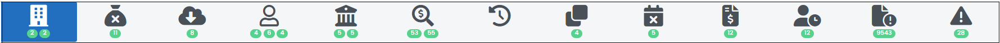
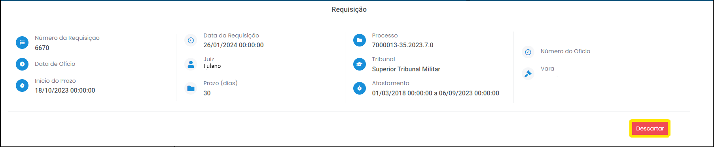
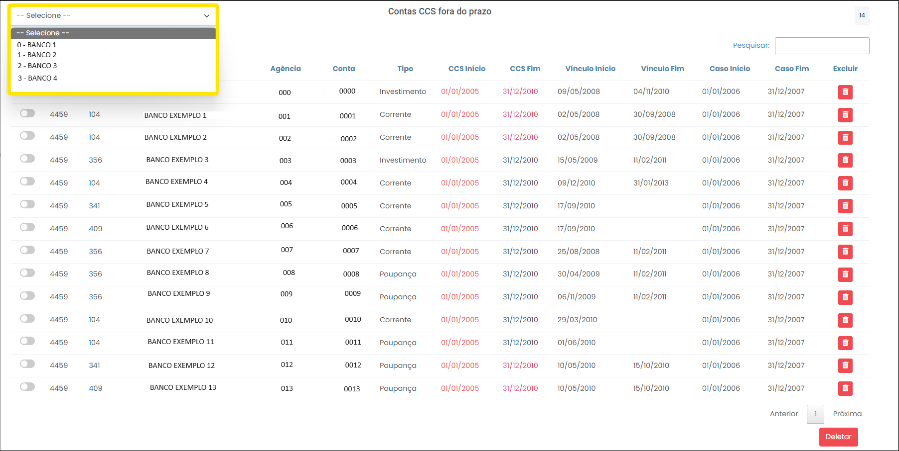

# Iniciando o processo de quarentena 

1 Para pesquisar um caso desejado, digite o N° do Caso no campo localizado no centro da página (Figura 6). 

 
*Figura 6 - Procurar casos.*   

2 Em seguida, clique em "Acessar Quarentena", no pedido desejado (Figura 7). 

 
*Figura 7 - Acessar Quarentena.*   

Na página aberta, é possível visualizar o título, o status, o período e a data do pedido do caso, além da lotação e o nome do solicitante (Figura 8).

 
*Figura 8 - Informações básicas do caso.*   

##  Requisição  

 
*Figura 9 - Requisições.*   

Nesta aba é possível visualizar todas as ---REQUISIÇÕES?--- de ---CCS?---. Para acessar os detalhes de cada requisição, basta clicar no número da requisição (Figura 10). 

 
*Figura 10 - Acessar detalhes da requisição.*   

A partir da expansão dos detalhes da requisição, é possível identificar as contas por bancos, utilizando a caixa de seleção (Figura 11). 

 
*Figura 11 - Seleção de CCS por Bancos*   

É possível excluir as contas desnecessárias uma por uma ou selecionando todas as contas de uma vez só (Figura 12):

 
*Figura 12 - Excluir conta de Bancos*   

Ao clicar em deletar, uma janela será aberta com um campo de justificativa da exclusão - o registro é relevante quando o quarentenista, após algum tempo, quiser recuperar os dados ou saber a causa do descarte (Figura 13).

 
*Figura 13 - Justificar exclusão de conta.*   

Realizada a exclusão, as contas descartadas ficam registradas e podem ser recuperadas a qualquer tempo (Figura 14):

 
*Figura 14 - Contas descartadas do CCS vs. Recuperação.*   

Por fim, também é possível excluir toda a requisição, caso se julgue oportuno. Para isso, clique em "Descartar" (Figura 15). Ao clicar em "Descartar", uma janela será aberta com um campo de justificativa para o descarte (Figura 16).
 
 
*Figura 15 - Descartar Requisição.* 

 
*Figura 16 - Justificar descarte de CCS.*   

Realizado o descarte, os CCS descartados ficam registrados e podem ser recuperadas a qualquer tempo (Figura 17):

 
*Figura 17 - CCS descartados vs. Recuperação.*   

##  Contas CCS fora do prazo  

 
*Figura 18 - Contas CCS fora do prazo.*   

Nessa aba é possível visualizar todas as contas CCS fora do prazo, ordenáveis por bancos (Figura 19).

 
*Figura 18 - Contas CCS fora do prazo.*   

