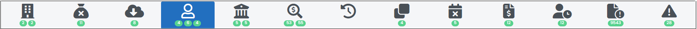

# Investigados

 
*Figura 42 - Aba "Investigados".*   

Nesta aba é possível comparar as informações sobre qualificação dos investigados com aquelas provenientes do PAI, do Pedido de Afastamento de Sigilo Bancário (PQSB), da Decisão Judicial e do CCS/Bacen. 

Para isso, é preciso baixar os documentos jurídicos no botão CCS, como já explicado [capítulo do cabeçalho](Página2.md/#cabeçalho). 

