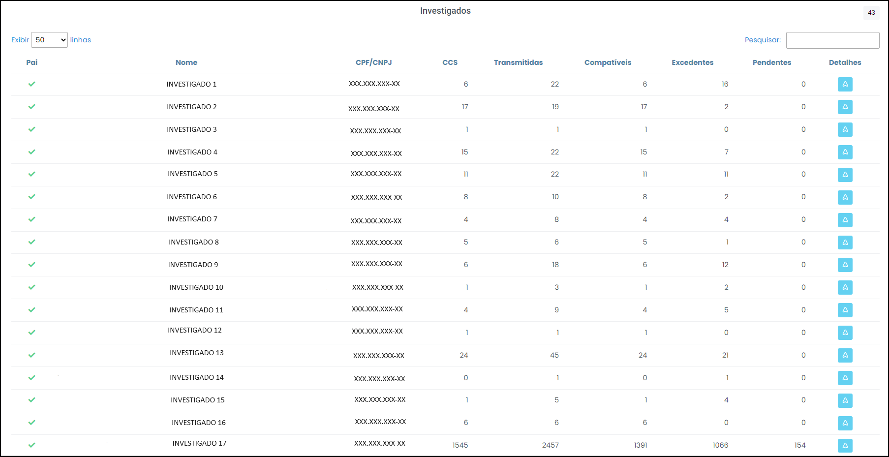

# Investigados

 
*Figura 41 - Aba "Investigados".*   

Nesta aba é possível comparar as informações sobre qualificação dos investigados com aquelas provenientes do PAI, do Pedido de Afastamento de Sigilo Bancário (PQSB), da Decisão Judicial e do CCS/Bacen. 

Para isso, é preciso baixar os documentos jurídicos no botão CCS, como já explicado [capítulo do cabeçalho](Página2.md/#cabeçalho). 

Por esta aba, verifica-se a quantidade de investigados cadastrados no PAI em comparação ao Pedido de Afastamento de Sigilo Bancário (PQSB) e à decisão judicial.

## Tabela Investigados

 
*Figura 42 - Tabela "Investigados".*  

Os dados são dispostos em colunas. O significado de cada coluna é o seguinte: 

<ul style="text-align: justify;" >
<li><strong>Nome: </strong> composto por prenome, sobrenome para pessoas físicas e razão social ou firma para pessoas jurídicas. </li>
<li><strong>CPF/CNPJ:</strong> nº de cadastro que identifica a pessoa junto a receita federal. </li>
<li><strong>CCS: </strong> Cadastro do Banco Central que revela quais contas devem ser encaminhadas. </li>
<li><strong>Transmitidas:</strong> contas efetivamente encaminhadas pelas instituições financeiras. </li>
<li><strong>Compatíveis :</strong> contas efetivamente encaminhadas pelas instituições financeiras e compatíveis com os dados do CCS. </li>
<li><strong>Excedentes: </strong>contas efetivamente encaminhadas pelas instituições financeiras e além do CCS. </li> 
<li><strong>Pendentes: </strong>contas não encaminhadas pelas instituições financeiras e constantes do CCS. </li>
<li><strong>Detalhes: </strong> (Figura x) rol de contas relacionadas ao investigado segregadas por banco, nº de conta, tipo de conta, período de movimentação, quantidade de linhas, percentual de identificação de transações obrigatórias e situação da conta (compatível, excedente e pendente). </li>
</ul>

 
*Figura 43 - Contas Relacionadas.*  

 Ainda em <u>Detalhes</u> (Contas Relacionadas), temos os seguintes botões (Figura 44): 

<ul style="text-align: justify;">
  <li><strong>Botão "Incluir no PAI":</strong> permite cadastrar uma pessoa que inicialmente não foi cadastrada no preenchimento do PAI. </li>
  <li><strong>Botão "Excluir Investigado":</strong> permite excluir uma pessoa inicialmente cadastrada no PAI mas que teve o pedido de afastamento de sigilo dos seus dados indeferido pela autoridade judiciária ou permite excluir dados relativos à pessoa não cadastrada e que teve os seus dados indevidamente encaminhados via SIMBA. </li>
</ul>

 
*Figura 44 - Botões "Incluir no PAI" e "Excluir Investigado".*  

## Pedido Incompleto

<svg height="35px" width="25px" style="vertical-align: middle" version="1.1" id="Layer_1" xmlns="http://www.w3.org/2000/svg" xmlns:xlink="http://www.w3.org/1999/xlink" viewBox="0 0 511.999 511.999" xml:space="preserve" fill="#000000" stroke="#000000"><g id="SVGRepo_bgCarrier" stroke-width="0"></g><g id="SVGRepo_tracerCarrier" stroke-linecap="round" stroke-linejoin="round"></g><g id="SVGRepo_iconCarrier"> <path style="fill:#F5C525;" d="M16.242,429.476L232.332,55.195c10.518-18.219,36.814-18.219,47.333,0l216.091,374.281 c10.518,18.219-2.63,40.991-23.666,40.991H39.908C18.872,470.467,5.723,447.695,16.242,429.476z"></path> <g> <path style="fill:#EFEFEF;" d="M255.999,322.45L255.999,322.45c-14.172,0-25.66-11.488-25.66-25.66V172.87 c0-14.172,11.488-25.66,25.66-25.66l0,0c14.172,0,25.66,11.488,25.66,25.66v123.92C281.659,310.962,270.171,322.45,255.999,322.45z "></path> <circle style="fill:#EFEFEF;" cx="256.001" cy="397.558" r="25.034"></circle> </g> <g> <path style="fill:#231F20;" d="M506.597,423.218L290.506,48.937C283.304,36.462,270.404,29.014,256,29.014 c-14.404,0-27.304,7.448-34.506,19.922L5.402,423.218c-7.202,12.475-7.202,27.37,0,39.845 c7.202,12.475,20.103,19.922,34.507,19.922h432.183c14.405,0,27.305-7.448,34.507-19.922 C513.799,450.588,513.799,435.692,506.597,423.218z M484.917,450.545c-1.286,2.227-5.108,7.405-12.826,7.405H39.908 c-7.718,0-11.541-5.178-12.826-7.405c-1.286-2.227-3.859-8.126,0-14.81L243.172,61.454c3.859-6.683,10.255-7.405,12.826-7.405 s8.967,0.722,12.826,7.405l216.091,374.281C488.775,442.419,486.201,448.318,484.917,450.545z"></path> <path style="fill:#231F20;" d="M255.999,134.692c-21.051,0-38.177,17.126-38.177,38.177v123.92 c0,21.051,17.126,38.178,38.177,38.178s38.177-17.126,38.177-38.177V172.87C294.176,151.818,277.05,134.692,255.999,134.692z M269.142,296.79c0,7.247-5.896,13.143-13.143,13.143s-13.143-5.896-13.143-13.143V172.87c0-7.247,5.896-13.143,13.143-13.143 s13.143,5.896,13.143,13.143V296.79z"></path> <path style="fill:#231F20;" d="M255.999,360.002c-20.706,0-37.552,16.846-37.552,37.552c0,20.706,16.846,37.552,37.552,37.552 s37.552-16.846,37.552-37.552C293.55,376.848,276.705,360.002,255.999,360.002z M255.999,410.071 c-6.902,0-12.517-5.615-12.517-12.517c0-6.902,5.615-12.517,12.517-12.517s12.517,5.615,12.517,12.517 C268.516,404.455,262.901,410.071,255.999,410.071z"></path> </g> </g></svg> Caso o Pedido de Apoio esteja incompleto, cabe ao solicitante duas possibilidades:

<ol type="a">
  <li>Se o Banco Central não foi intimado da decisão judicial para comunicar as instituições financeiras e remeter o CCS, é possível adicionar investigados ao pedido e sanear a petição indicando ao juiz a inclusão das novas pessoas;</li>
  <li>Se o Bacen já foi oficiado, cabe ao solicitante encerrar o pedido, tendo em vista o erro insanável, e abrir um novo pedido com o rol completo de pessoas investigadas.</li>
</ol>

## Discrepâncias comuns

As discrepâncias mais comuns de serem encontradas na Quarentena são: 

<ol type="a" style="text-align: justify;">
  <li>CPF/CNPJ incompatíveis com a Decisão; </li>
  <li>Dados bancários de filiais que não tiveram seu sigilo afastado; </li>
  <li>Contas vinculadas a pessoas investigadas e não investigadas (múltiplos vínculos); </li>
  <li>Contas que aparecem pendentes para um vínculo, mas que foram encaminhadas em nome de outro investigado (o outro vínculo da conta). </li>
</ol>

